AWS VPC과 서브넷 설정을 해보자!
AWS 계정을 처음 생성하면 루트유저와 기본 리소스(기본 VPC)등이 생성된다.

오늘 해볼 것은 아래 도식과 같은 형태의 설정을 완료하는 것이다.
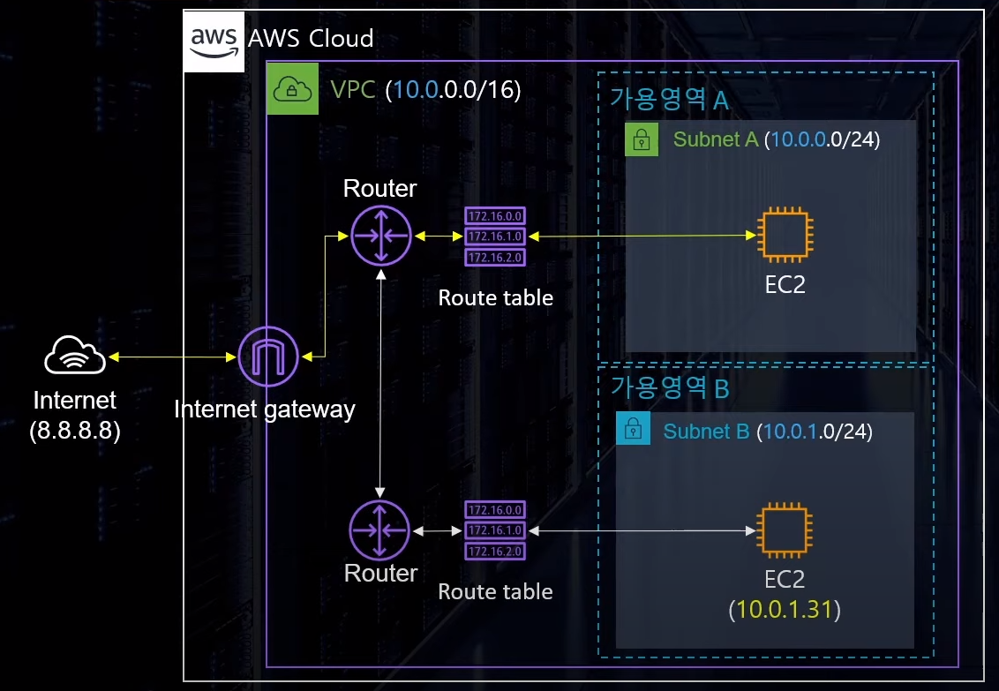

### VPC을 만들고 설정 확인하기

AWS 계정을 만들고 나면 아래와 같이 기본 VPC가 있다.
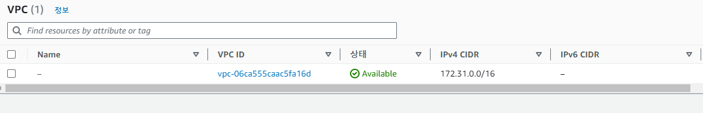

오늘은 기본 VPC를 사용하는 것이 아닌 새롭게 VPC를 생성할 것이다. 생성해보자!  
생성할 리소르 부분에 "VPC 등"을 체크하면 라우팅 테이블, IGW 등이 알아서 생성이 된다.  
학습을 위해 "VPC만"으로 생성해서 라우팅 테이블, IGW 등을 연결해줄 것이다.  
이름을 작성하고, IPv4 CIDR는 VPC를 생성할 수 있는 가장 큰 대역인 /16로 설정해주었다.

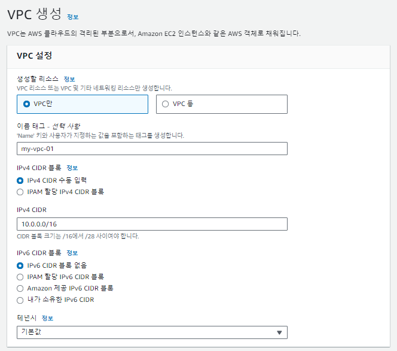

다행히 어렵지 않게 VPC 생성완료!!🎉
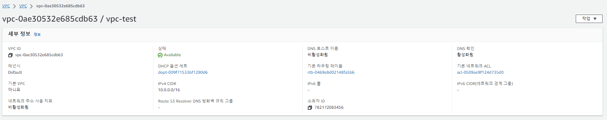

### Subnet 생성하기

VPC를 만들었으니 Subnet을 만들어보자.  
Subnet은 Public Subnet2개/ Private Subnet 2개를 만들 것이다.  
test로 만드는 것이라 상관없긴 하겠지만, 한쪽의 가용공간(AZ)에서 네트워크 이슈 등이 발생했을 때  
다른 한쪽의 AZ로 커버하여 가용성을 보장하기 위해서 2개씩 만들 것이다.
위에서 만들었던 vpc를 선택하여 Subnet을 생성한다.
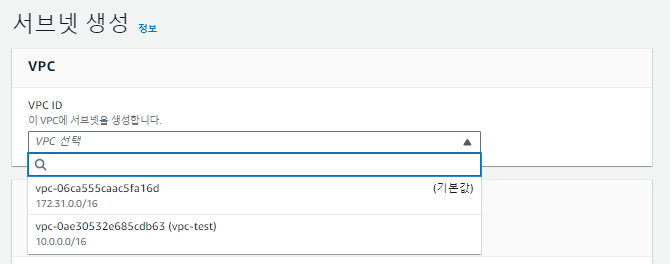  
Subnet 설정에서 IPv4 subnet CIDR block부분에  
10.0.1.0/24  
10.0.2.0/24  
10.0.3.0/24  
10.0.4.0/24
... 와 같이 각 Subnet을 다르게 작성해줘야하는 것을 주의한다.
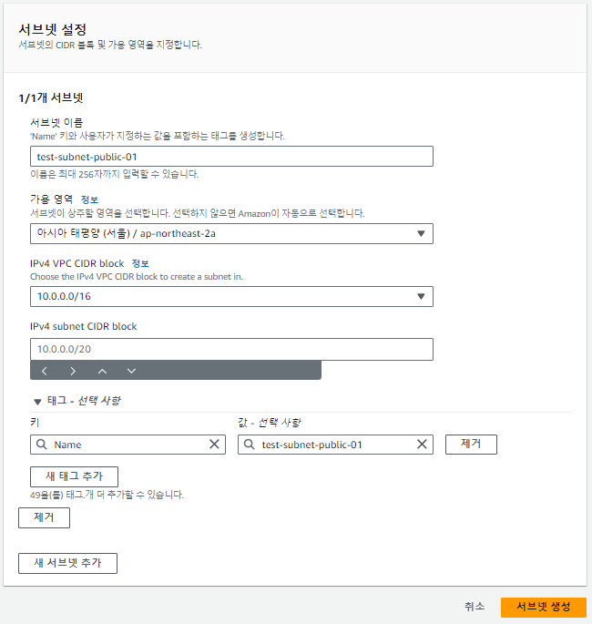  
Subnet도 빠르게 생성완료!!🎉🎉
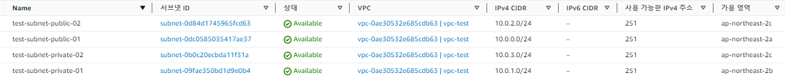

### EC2 테스트용 인스턴스 만들기

테스트 하기 위해 EC2 인스턴스를 만든다. EC2가 이미 있는 사람은 이 단계를 넘어가면 되겠다.
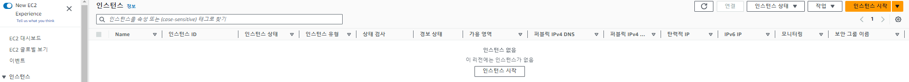  
인스턴스 이름을 설정해준다.  
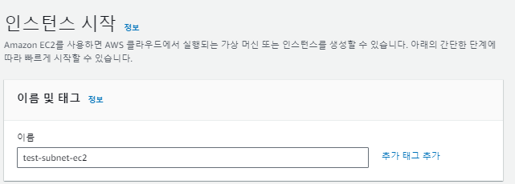  
AMI는 Amazon Linux, 인스턴스 타입은 t2.micro로 선택한다.  
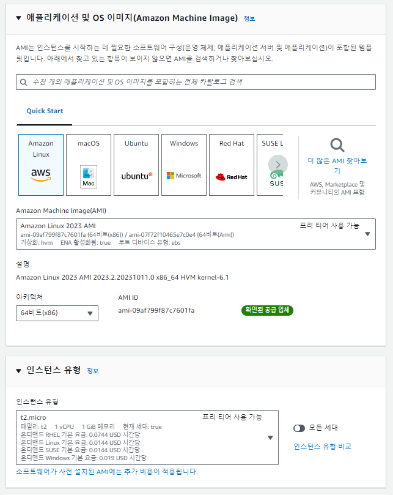  
위에서 생성한 Public Subnet 중 하나를 선택하고,  
자동 할당 퍼블릭 IP는 활성화로 체크한다.  
그리고 인바운드 보안그룹(SG) 규칙을 만들어 SSH만 열어 인스턴스를 할당한다.  
(인스턴스 만들고 나서 SG 따로 만들어서 할당하는 방법도 있음)
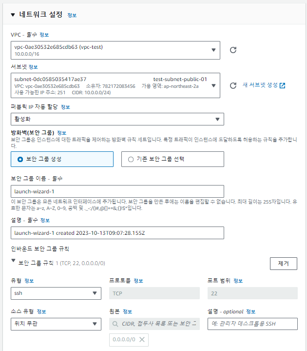  
EC2 인스턴스 생성완료!!🎉🎉🎉
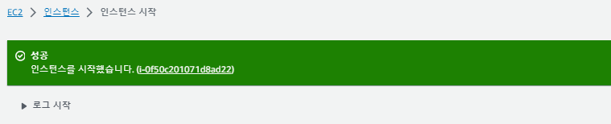  
생성한 EC2 인스턴스에 SSH접근을 시도해보았지만, Fail!!!  
지극히 정상이다😊 걱정말자!  
(확인삼아 시도해보았을 뿐 이 과정은 패스해도 무관하다.)
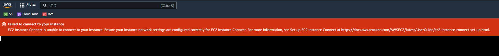

Public Subnet이라 하더라도  
IGW가 연결되지 않았으니 당연히 외부 연결 안 되어있다.

### IGW 생성

IGW 생성 및 외부와 연결되는 서브넷과 IGW을 연결시켜주자.  
이름을 작성하고 생성~ 매우 쉽쥬~  
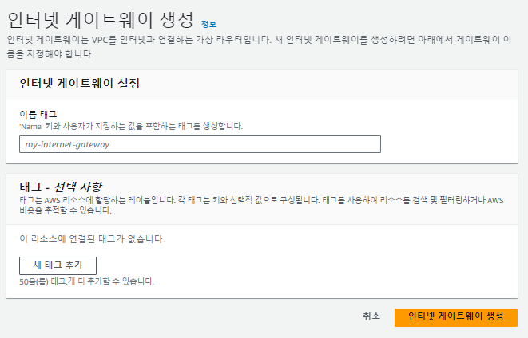  
생성한 IGW를 선택하고 우측 상단 셀렉트 박스에서 'VPC에 연결' gogo!  
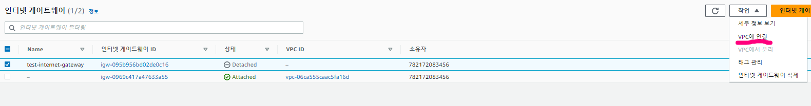  
위에서 생성했던 VPC연결!!  
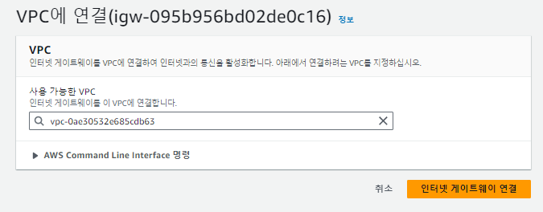  
연결 완료!! 다시 접근 시도!! 실패!! 역시나 접근 실패가 정상이다!!  
(확인삼아 시도해보았을 뿐 이 과정은 패스해도 무관하다.)
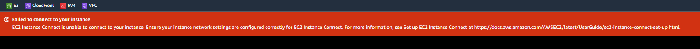

### Route Table 를 통해 IGW 와 EC2 를 연결하기

EC2, IGW, Subnet, VPC 모두 잘 생성되었는데, 왜 아직도 접근이 안되는가?!  
서브넷 또는 게이트웨이의 네트워크 트래픽이 전송되는 위치를 결정하는 라우팅 테이블을 만들어  
명시적으로 Subnet을 연결해줘야 한다.

기본적으로 서브넷을 만들면 AWS가 자동으로 네트워크 ACL을 붙여주고, 라우팅 테이블을 연결시켜준다.
자동으로 만들어진 라우팅 테이블은 명시적으로 연결되지 않은 모든 서브넷의 라우팅을 제어한다.  
그래서 Public 라우팅 테이블, private 라우팅 테이블을 만들어 각각 명시적으로 서브넷을 연결하자.  
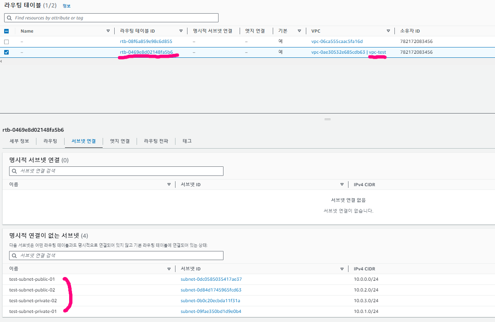  
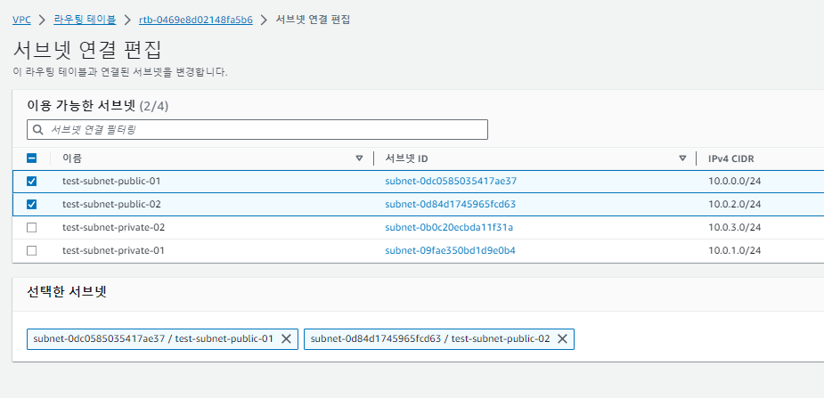  
연결을 완료하였고, 사진 하단에 명시적 연결이 없는 서브넷이 비어있는 것을 볼 수 있다.  
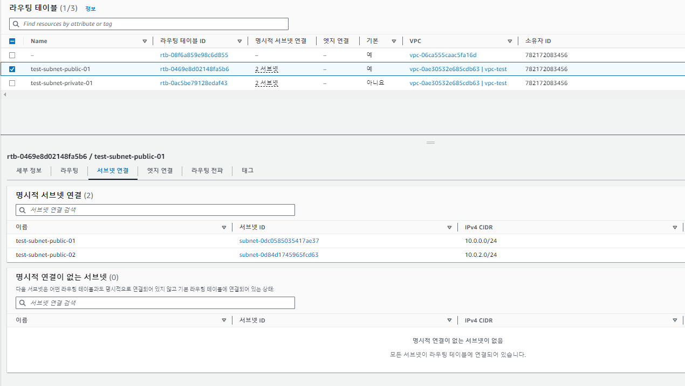  
Route 편집으로 경로를 정의해주자.
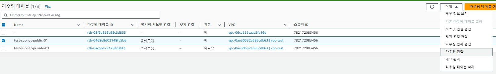  
앞서 만든 IGW 를 추가하고,  
로컬 트래픽이 아닌 모든 트래픽을 인터넷게이트로 가게 하기 위해 0.0.0.0/0 으로 설정한다.  
이제 모든 설정이 끝났다!!  
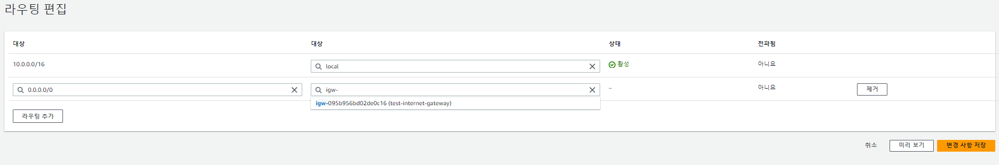

### 설정 및 연결 확인

인스턴스 SSH (22) 접근에 잘 접근하였고,  
인스턴스 내에서 ping google.com 입력하여 정보를 잘 받아오고 있음을 확인 할 수 있다!!!🎉🎉
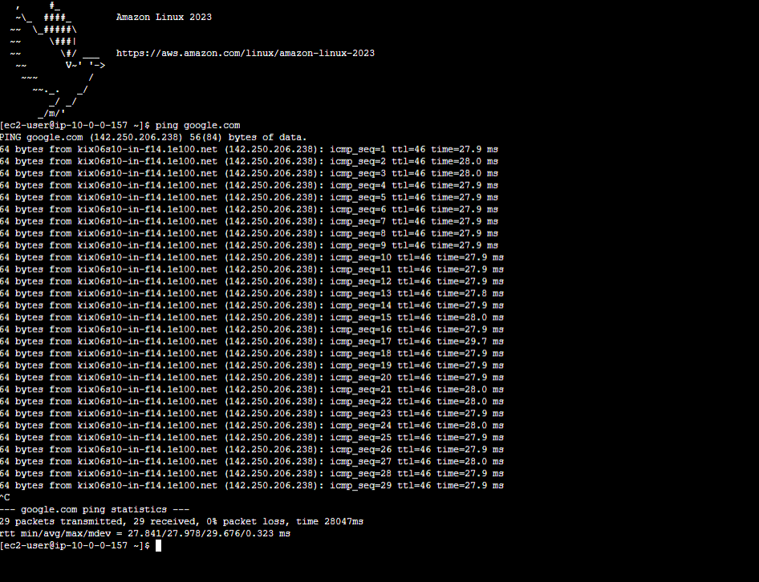

### 마치며🎉

AWS... EC2... 네트워크... 게이트웨이...  
나에게는 어렵고 또는 무서운 그런 용어들이었는데,  
이렇게 하나 하나 학습하고 배워서 직접 설정해보니 조금은 머리속에 그림이 그려지는 듯해서 아주 기쁘다!!  
조금씩 친해져봐야겠다 ㅎㅎㅎ

### 출처

-   https://www.youtube.com/watch?v=hi6S3DUJBBk&list=PLfth0bK2MgIan-SzGpHIbfnCnjj583K2m&index=20
