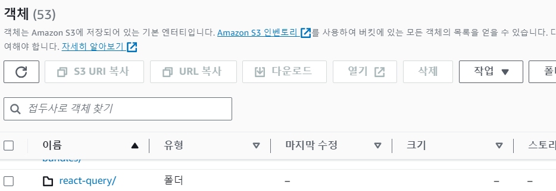
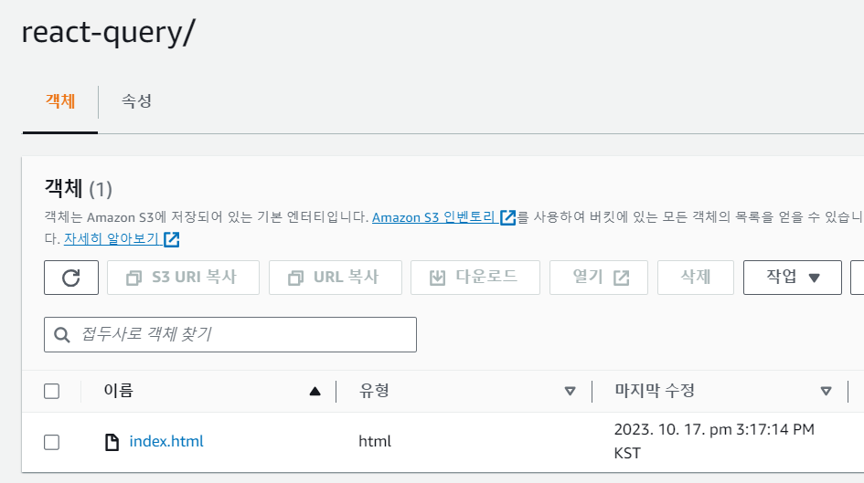
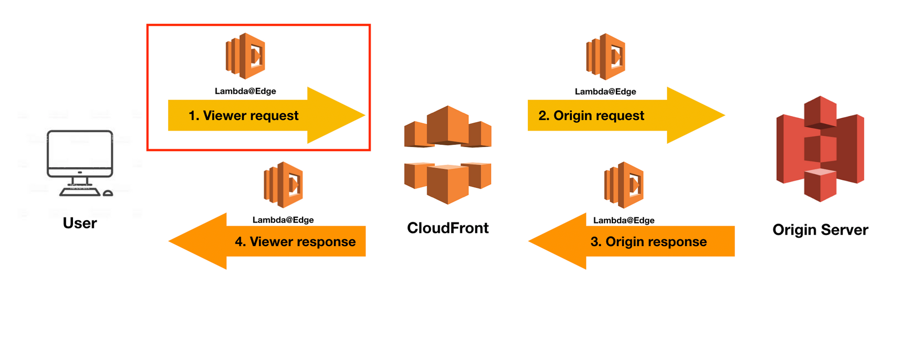
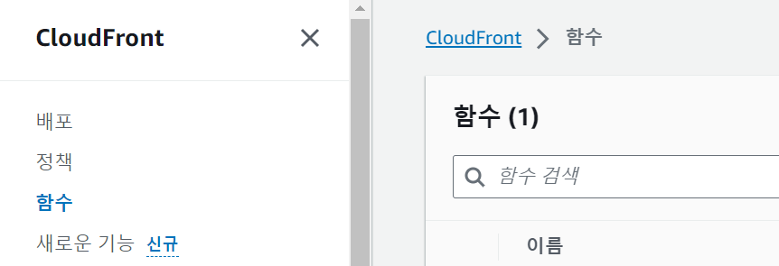
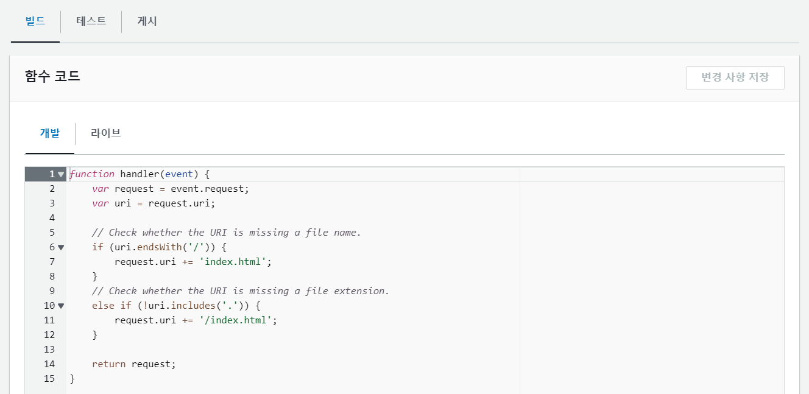
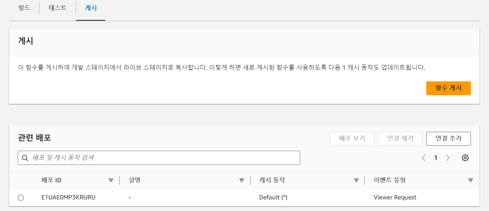
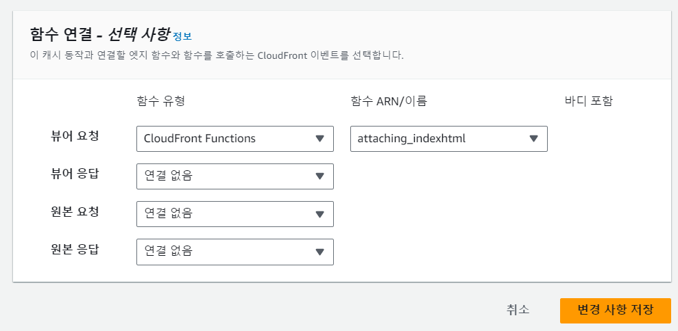

이 블로그는 S3와 cloudfront로 배포하였다.  
아주 무사히 잘 배포하였다고 생각했는데,  
어느 날, 지인에게 블로그 글의 URL을 보내주려고 https://d301gw6ixi4s19.cloudfront.net/react-query/ 이렇게 복사하여 보냈는데,  
계속 https://d301gw6ixi4s19.cloudfront.net로 튕겨나갔다고 하는 것이다.  
OMG!! 이제라도 발견해서 다행이다!! 빠르게 해결해보자!!

### ❓ 원인

원인이 무엇일까...

-   배포가 안되고 있는 것은 아닐까?  
    S3를 확인해보니 매우 잘 배포가 되고 있었다.
    
-   폴더 안으로 들어가보니, 원인을 알 것 같았다.
    

각 포스트는 폴더 안에 index.html로 되어있다. 브라우저는 사용자 경험을 향상시키기 위해 index.html을 자동으로 제거하고, 사용자가 명시적으로 파일 이름을 입력하지 않아도 해당 디렉토리의 index.html 파일을 보여줌으로써 사용자에게 불필요한 정보를 숨겨준다.  
그런데!! 그런 브라우저의 기능을 cloudfront는 이해하지 못하고, https://d301gw6ixi4s19.cloudfront.net/react-query/ 뒤에 index.html이 없다고 판단하여 index.html 파일을 반환하지 못하고, 없는 폴더 혹은 파일로 인지하여 메인 페이지로 리다이렉트 시키는 것이었다.

### 💊 해결방안

이를 해결하기 위해 CloudFront 이벤트를 살짝 알아보자.
cloudFront에는 4가지 이벤트가 있다.

1. viewer request (뷰어 요청) : 이 함수는 CloudFront가 사용자로부터 요청을 수신하면 실행되며, 요청된 객체가 CloudFront 캐시에 있는지 확인한다.
2. Origin request (원본 요청) : 이 함수는 CloudFront가 Origin인 S3으로 요청을 전달할 경우에만 실행되며, 요청된 객체가 CloudFront 캐시에 저장되어 있지 않은 경우 실행된다.
3. Origin response (원본 응답) : 이 함수는 CloudFront가 Origin으로부터 응답을 수신한 후 실행되어 응답의 객체를 캐싱한다. 요청된 파일이 CloudFront 캐시에 있고 만료되지 않았거나 요청 이벤트가 트리거한 함수로부터 응답이 생성되는 경우 실행되지 않는다.
4. Viewer response (뷰어 응답) : 요청된 파일을 최종 사용자에게 반환하기 전에 함수가 실행다. 이때 함수는 해당 파일이 이미 CloudFront 캐시에 있는지 여부와 상관없이 실행된다.



위의 문제가 발생하는 이유는 Viewer request에서 index.html 파일을 없다고 인지하기 때문이다. 그래서 Viewer request에 해결을 위한 함수를 작성해주면 된다. 작성해보자!!

CloudFront에서 함수로 가서 함수 생성을 해준다.
  
함수 이름을 생성해주고, 코드를 작성해준다.

```javascript
function handler(event) {
    var request = event.request
    var uri = request.uri

    if (uri.endsWith("/")) {
        request.uri += "index.html"
    } else if (!uri.includes(".")) {
        request.uri += "/index.html"
    }
    return request
}
```

코드를 작성하는 부분에 테스트할 수 있는 탭이 있으니까 테스트도 꼭 해보자!



테스트가 완료된 코드를 게시해주고 하단에 배포중인 CloudFront에 연결해주고,



배포중인 CloudFront 동작 편집에 가서 함수 연결을 해준다.  
사용자의 요청을 받아올 때 실행되어야 함으로 뷰어 요청에 연결해준다.

 
<br/>
<br/>
해결완료!!💪💪
<br/>
<br/>

### 마치며🎉

공들여 만들고 있는 중인 블로그에 버그가 있다니 매우 슬펐다. 그래도 스스로 해결해낼 수 있어서 좋았고, CloudFront 4가지 이벤트를 알았으니 다양하게 적용해봐야겠다.

### 출처

-   https://docs.aws.amazon.com/ko_kr/AmazonCloudFront/latest/DeveloperGuide/lambda-cloudfront-trigger-events.html
