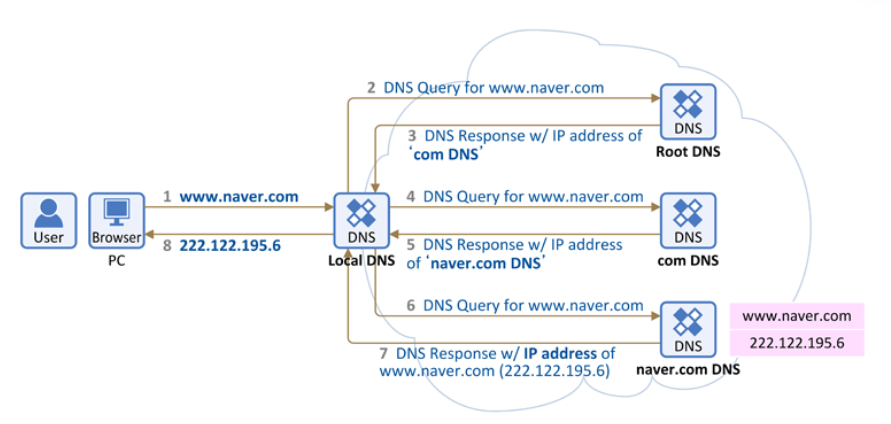

### DNS란 무엇인가?

DNS를 알기 위해서는 IP와 도메인을 이해 해야 한다.
 

#### IP란?

---

인터넷에 연결되어 있는 장치들은 서로 찾고 통신하기 위해 각각의 장치를 식별할 수 있는 주소를 가지고 있는데 이를 IP라고 한다.  
 → 예 : 192.168.0.1

#### 도메인(domain)이란?

---

ip는 사람이 이해하고 기억하기 어렵기 때문에 각 ip에 이름을 부여한 것!

DNS는 사람이 읽을 수 있는 도메인 이름을 IP 주소로 변환하여 해당 IP주소로 접속

|    서비스     | 도메인 주소 |     IP 주소     |
| :-----------: | :---------: | :-------------: |
|  다음(Daum)   |  daum.net   | 203.133.167.81  |
| 네이버(Naver) |  naver.com  | 223.130.200.104 |
| 구글(Google)  | google.com  | 142.250.207.14  |

### DNS동작방식

1. 도메인 주소를 브라우저에 입력하게 되면, 도메인 주소를 가지고 있는 DNS서버에 접속
    - Local DNS (인터넷을 사용하기 위해 IP를 할당해주는 통신사의 기지국 DNS)에 IP주소를 요청
    - Root DNS(ICANN이 직접 관리하는 절대 존엄 서버) 에 IP주소를 요청
    - TLD DNS(도메인 등록기관이 관리하는 최상위 도메인 서버로 .com/.co.kr 과 같은 도메인 네임의 마지막 부분 확인)에 IP주소를 요청
    - Authoritative DNS(개인이나 회사 DNS 서버 구축을 한 경우에도 여기에 해당)에 IP주소를 요청
2. 네임서버에 접속한 도메인과 연결된 IP정보를 확인하고, IP를 Local DNS 서버에 응답
3. 응답받은 **Local DNS는 IP주소를 캐싱**하고 사용자 pc에 전달
4. 사용자 pc는 전달받은 서버의 IP주소로 접속
5. 서버의 IP로 연결된 브라우저에 서버의 내용 출력

### 도메인 등록

도메인을 등록하면 해당 도메인 이름은 기업이나 개인에게 소유권이 부여되며, 다른 도메인 이름과 중복되지 않는 고유한 식별자로 설정된다. 연간 비용이 발생한다.

### 호스팅

웹사이트를 온라인으로 게시하기 위해 필요한 서버 공간을 제공.  
이 서버는 웹사이트 파일, 데이터베이스, 이미지 등을 저장하고 사용자가 웹사이트를 방문할 때 이 정보들을 제공한다.

|                  |                                                                                                                        |
| :--------------: | :--------------------------------------------------------------------------------------------------------------------: |
|   공유 호스팅    |                                  여러 웹사이트가 하나의 물리적인 서버를 공유하는 형태                                  |
| 전용 서버 호스팅 | 한 사이트가 전용 서버를 이용하는 형태로, 높은 성능과 커스터마이징이 가능하지만 비용이 높고 유지보수에 관한 책임도 크다 |
| 클라우드 호스팅  |     여러 대의 서버를 이용하여 필요에 따라 유동적으로 자원을 할당하는 형태로, 유연성과 안정성 면에서 장점을 가진다.     |

### 도메인과 호스팅의 차이?

**도메인등록**은 건물을 짓고 건물의 주소를 확보하는 것

**호스팅**은 건물에 1층을 빌려서 입주하는 것

### 요약

DNS는 각각의 장치를 식별하는 주소인 IP를 기억하기 쉽도록 이름을 부여한 도메인과 맵핑해준다. 건물을 짓고 부여된 주소를 주소록에 저장해두는 것과 같다. 호스팅은 웹 어플리케이션을 웹에 게시하기 위해 필요한 서버 공간을 제공해주는 것으로 지어진 건물의 한 공간을 대여하여 사용하는 것으로 비유할 수 있다.

### 출처

-   https://aws.amazon.com/ko/route53/what-is-dns/
-   https://aws.amazon.com/ko/what-is/web-hosting/
-   [https://inpa.tistory.com/entry/WEB-🌐-DNS-개념-동작-완벽-이해-★-알기-쉽게-정리](https://inpa.tistory.com/entry/WEB-%F0%9F%8C%90-DNS-%EA%B0%9C%EB%85%90-%EB%8F%99%EC%9E%91-%EC%99%84%EB%B2%BD-%EC%9D%B4%ED%95%B4-%E2%98%85-%EC%95%8C%EA%B8%B0-%EC%89%BD%EA%B2%8C-%EC%A0%95%EB%A6%AC)
