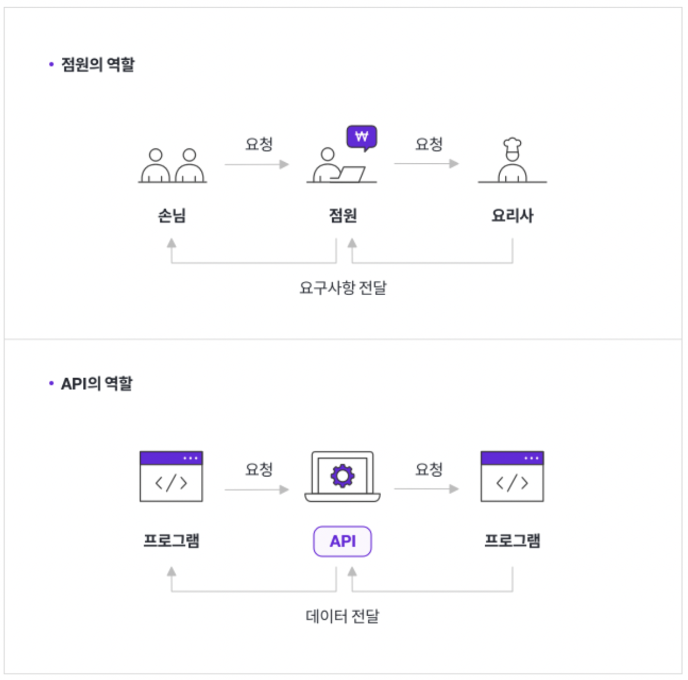

REST API, 많이 들어보고 사실 API 호출을 위해 많이 사용해보았다.  
사용한다고 아는 것인가?  
제대로 알고 사용하기 위해 학습해본다!

## API(Application Programming Interface)

REST API를 알기위해서는 먼저 API가 무엇인지 정확히 해보자.  
Interface... 이 단어가 나에게는 추상적이게 느껴졌지만, 사실 간단하다.  

 

1.  **interface** : 소통하는 창구 / 어플리케이션 간의 계약 -> **요청과 응답을 통해 서로 통신하는 방법**

    -   예 : 컴퓨터🖥️ with 마우스🖱️ / TV📺 with 게임기🎮 / 핸드폰📱 with 이어폰🎧

2.  **application** : 고유한 기능을 가진 모든 소프트웨어!

✍️ 즉, API는 정의 및 프로토콜 집합을 사용하여 소프트웨어 구성 요소가 서로 통신할 수 있게 하는 매커니즘
 

### API 작동 방식

API가 생성된 시기와 이유에 따라 API는 네 가지 작동 방식으로 나뉜다.

-   클라이언트 : 요청을 보내는 어플리케이션
-   서버 : 요청을 받는 어플리케이션

<table>
    <tbody>
        <tr>
            <td style=" */
    width: 17%;
">SOAP API</td>
            <td>단순 객체 접근 프로토콜을 사용  
                클라이언트와 서버는 XML 사용하여 메시지 교환  
                과거에 더 많이 사용되었으며 유연성이 떨어지는 API 
            </td>
        </tr>
        <tr>
            <td style=" */
    width: 17%;
">RPC API </td>
            <td>
            원격 프로시저 호출  
            클라이언트가 서버에서 함수나 프로시저를 직접적으로 호출하고, 직접 호출 중에 하나 이상의 데이터 값이 서버에 전달
            </td>
        </tr>
        <tr>
            <td style=" */
    width: 17%;
">Websocket API</td>
            <td>
            클라이언트 앱과 서버 간의 양방향 통신을 지원 
서버가 연결된 클라이언트에 콜백 메시지를 전송가능
            </td>
        </tr>
        <tr>
            <td style=" */
    width: 17%;
">REST API  </td>
            <td>
가장 많이 사용되고 유연한 API 
클라이언트가 서버에 요청을 데이터로 전송 
서버가 클라이언트의 입력을 사용하여 내부 함수를 시작하고 출력 데이터를 클라이언트에 반환
            </td>
        </tr>
    </tbody>
</table>

## REST API

**REST API**는  
API 작동 방식에 대한 조건을 부과하는 소프트웨어 아키텍쳐로 **요청의 모습 자체로 추론이 가능하다는 것이 가장 큰 특징이다!**  
 

### REST API의 특징

1. **균일한 인터페이스** : 서버가 표준 형식으로 정보를 전송한다.
    - 자원을 구조와 함께 나타내는 구분자인 URI로 인해 가능하다.
2. **무상태성** : 작업을 위한 상태정보를 따로 저장하고 관리하지 않는다. 세션 정보나 쿠키정보를 별도로 저장하고 관리하지 않기 때문에 API 서버는 들어오는 요청만을 처리하면 된다.
3. **캐시 가능** : HTTP라는 기존 웹표준을 그대로 사용하기 때문에, HTTP가 가진 캐싱 기능 적용가능
    - `GET` : 일반적으로 브라우저에서 cache가 사용 가능하게 처리
    - `POST` : 일반적으로 cache가 사용 불가능. 하지만 Expires와 Cache-Control header를 이용하여 caching 구현하여 응답 가능
4. **계층형 구조** : REST 서버는 다중 계층으로 구성될 수 있으며 보안, 로드 밸런싱, 암호화 계층을 추가해 구조상의 유연성을 둘 수 있다.
5. **온디멘드 코드** : 서버가 클라이언트에게 실행 가능한 코드를 다운로드하여 실행할 수 있는 기능을 제공한다.
    

### REST API 작동방식(ft. 인증방법)

1. 클라이언트가 서버에 요청
2. 서버가 클라이언트를 인증하고, 해당 요청을 수행할 수 있는 권한이 클라이언트에 있는지 확인. 이 때 4가지의 인증 방식이 있다.
    - 기본 인증 : HTTP 헤더에 사용자 이름과 암호
    - 토큰 베이스 인증 : 요청 헤더에 토큰을 넣어 전송
    - API Key 베이스 인증 : 리소스에 액세스하려고 할 때마다 고유한 API 키를 사용
    - OAuth (Open Authorization) : 먼저 암호를 요청한 다음 권한 부여 프로세스를 완료하기 위해 추가 토큰을 요청
3. 서버가 요청을 수신하고 내부적으로 처리
4. 서버가 클라이언트에 응답을 반환, 응답에는 클라이언트가 요청한 모든 정보도 포함
    

### REST API의 장점👍

-   **확장성** : 무상태성 + 캐싱 = 성능 저하 절대 용납 못함
-   **유연성** : 클라이언트-서버 완전 분리
-   **독립성** : 언어?기술? 맘에 드는 걸로 쓰세요

### REST API HTTP METHOD

| Method |     Action (행위)      | Payload (Body) |
| :----: | :--------------------: | :------------: |
|  GET   |      리소스 조회       |       X        |
|  POST  |      리소스 생성       |       O        |
|  PUT   | 리소스 전체 수정(교체) |       O        |
| PATCH  |    리소스 일부 수정    |       O        |
| DELETE |      리소스 삭제       |       X        |

### RESTf API 설계 가이드

물론, 프론트엔드가 API를 설계할 일은 없겠지만, 잘못 설계된 API를 보고 수정 요청이나 의논은 할 수 있어야할테니,  
아주 간단하게 설계 가이드를 알아보자.

1. URI는 정보의 자원을 표현한다.
    - 리소스명은 동사가 아닌 명사를 사용한다. HTTP Method가 동사이므로 혼란을 막기 위함이다.
    - 예 : GET /members/1👍 GET /members/delete/1👎
2. 자원에 대한 행위는 HTTP Method로 표현한다.
3. `/` 는 계층 관계를 나타내는데 사용함으로 URI 마지막 문자로 `/`를 사용하지 않는다.
4. `_`보다는 `-`를 사용한다. 밑줄 때문에 가려지는 문제를 예방하기 위해 또한 URI를 쉽게 읽고 해석하기 위함이다.
5. URI 경로에 대문자 사용을 피한다. 대소문자에 따라 다른 리소스로 인식하게 되기 때문이다.
6. 파일 확장자는 URI에 포함시키지 않는다.

## 마치며

REST 아키텍처 스타일을 따르는 API를 REST API  
REST 아키텍처를 구현하는 웹 서비스를 RESTful 웹 서비스  
하지만 REST API와 RESTful API라는 용어는 같은 의미로 사용된다.

## 출처

-   https://aws.amazon.com/ko/what-is/restful-api/
-   https://aws.amazon.com/ko/what-is/api/
-   https://aws.amazon.com/ko/compare/the-difference-between-rpc-and-rest/
