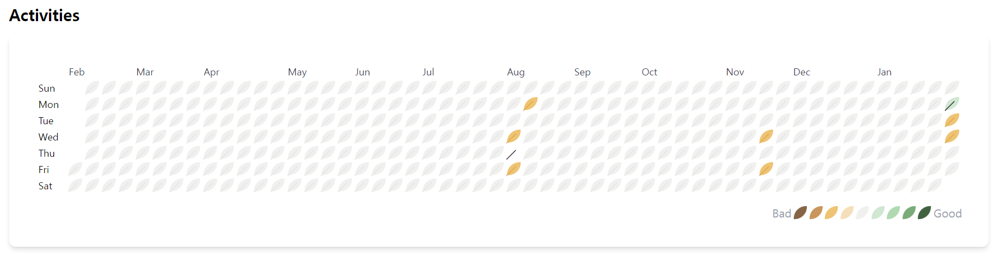
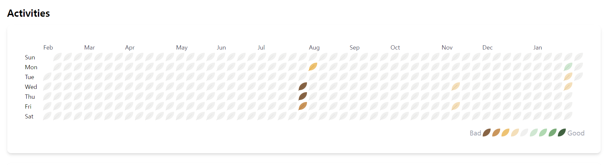

잔디UI를 구현하고, 제일 중요했던 부분은  
날짜별로 해결한 문제 갯수에 따라 다른 색으로 초록 잔디가 심어져야하고, 해결한 문제를 복습하지 않았다면 초록 잔디가 갈색(상한) 잔디로 심어져야 했다.  
솔직히 CSS에 자신있기 때문에 어렵지 않게 구현가능할 것이라고 생각했다.  
그.러.나.  
tailwind를 사용하다 보니 뭔가 내 맘처럼 적용되지 않았다.

### 👀 기존코드

tailwind.config.js에 theme를 이용해서 activity의 count값에 따라 적용할 색상을 작성해주었다.

```js
theme: {
    extend: {
        colors: {
            empty: { full: "#F0F0EF", line: "#E6E6E6" },
            good: {
                1: { full: "#D0E7D2", line: "#B9D8BC" },
                //...
            },
            bad: {
                1: { full: "#F4DFBA", line: "#E3CBA0" },
                //...
            },
        },
    },
},
```

작성해둔 theme값을 className에서 변수와 함께 작성하였다.

```html
<td className={`w-4 h-4 ${activity?.count == 0 ? "bg-empty-full after:text-empty-line" : `bg-good-${activity?.count}-full`}></td>
```

그 결과...  
적용이 완벽하게 되고 있지 않았다. 후🥲


### 🛠️ 개선하기

tailwind 동적 스타일링에 대해서 열심히 찾아보고, 공식문서를 수색해보았다.  
공식문서에 동적 스타일링 규칙을 찾을 수 있었다!! 나이스~

#### tailwind 동적 스타일링 규칙 [(tailwind 공식 문서)](https://tailwindcss.com/docs/content-configuration#dynamic-class-names)

💔Don't💔 클래스 이름을 동적으로 구성하지마라!

```html
<div class="text-{{ error ? 'red' : 'green' }}-600"></div>
```

(내가 사용했던 방식이다!!! 그러니 안되지...ㅎㅎ)  
💖Do💖완전한 클래스 이름을 사용해라!

```html
<div class="{{ error ? 'text-red-600' : 'text-green-600' }}"></div>
```

💔Don't💔 클래스 네임을 동적으로 만들기 위해 props를 이용하지마라!

```javascript
function Button({ color, children }) {
    return (
        <button className={`bg-${color}-600 hover:bg-${color}-500 ...`}>
            {children}
        </button>
    )
}
```

💖Do💖빌드타임에 정적으로 탐지될 수 있는 클래스 이름을 완성하려면 props를 맵핑해라!

```javascript
function Button({ color, children }) {
    const colorVariants = {
        blue: "bg-blue-600 hover:bg-blue-500",
        red: "bg-red-600 hover:bg-red-500",
    }

    return <button className={`${colorVariants[color]} ...`}>{children}</button>
}
```

공식문서를 꼼꼼히 틈틈히 읽자는 교훈을 얻으며,  
두 번째 방법으로 수정해보자!!

#### 코드를 수정하자!

tailwind.config.js에 작성한 코드를  
컴포넌트 내부에 작성하고 변수에 담아두었다.

```javascript
const activityBgColor = {
    good: {
        0: "bg-[#F0F0EF] after:text-[#E6E6E6]",
        1: "bg-[#D0E7D2] after:text-[#B9D8BC]",
        2: "bg-[#B0D9B1] after:text-[#8AB989]",
        3: "bg-[#79AC78] after:text-[#5F975E]",
        4: "bg-[#416241] after:text-[#235F23]",
    },
    bad: {
        0: "bg-[#F0F0EF] after:text-[#E6E6E6]",
        1: "bg-[#F4DFBA] after:text-[#E3CBA0]",
        2: "bg-[#EEC373] after:text-[#DFAA46]",
        3: "bg-[#CA965C] after:text-[#B27A3C]",
        4: "bg-[#876445] after:text-[#75563B]",
    },
}
```

그 후에 jsx 부분의 코드는 아래와 같이 수정해주었다.

```html
<td className={`${`${activity?.again ? activityBgColor["good"][activity?.level]:
activityBgColor["bad"][activity?.level]}`} >
```

activity.again은 복습여부를 true, false로 담아두었다.  
activity.level은 문제를 푼 갯수에 따라 0에서 4단계로 나누었다.
true이면 복습했다는 의미로 good에서 level이 activityBgColor의 객체 key의 value를 가져와서 적용하도록 했다.

과연!! 잘 적용이 될 것인가?!!

드디어 깔끔하게 적용이 되었다!!꺄!!!!

이제 다음 스탭으로 넘어가자!!

### 마치며🎉

평소 css나 scss를 많이 썼는데, tailwind를 쓰다보니 장점과 단점을 명확하게 느끼게 된다. 장점은 클래스 작명하는 시간이 줄어서 좋고, 간단하고 빠르다. 하지만 단점은 자동 완성 extention이 없다면 오히려 작성명이 익숙해질 때까지는 시간이 더 많이 걸릴 것 같고, 코드가 너무 지저분해진다ㅜㅜ 프로젝트를 진행하면서 theme 등을 이용해보면서 가장 효율적이게 사용하는 방법을 익혀야겠다.
