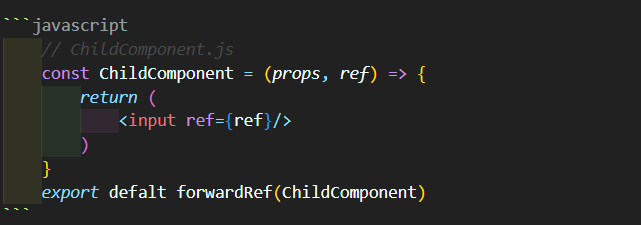
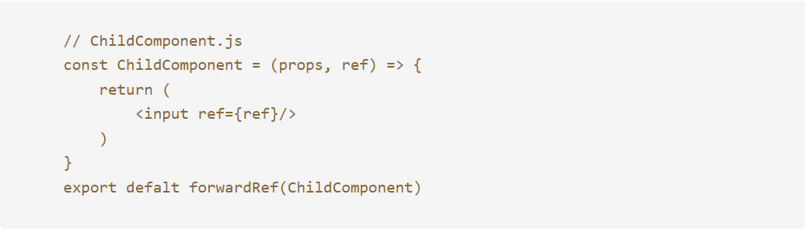

블로그가 점점 자리 잡혀가고 있다.  
하지만 아직 추가하고 싶은 기능, 스타일이 많다...  
그 중 하나인 '코드 블럭 하이라이트'!!  
코드블록을 개선해보자!!

### 🪺 Before


현재는 md파일에 위 그림과 같이 작성했을 때  
  
위 그림과 같이 배포된다.  
가독성이 정말 없다. 보는 재미도 없다.

### 🛠️ 구현하기

1.  코드 하이라이트 추가하기
    찾아보니 방법이 매우 간단했다. gatsby-remark-prismjs 플러그인을 적용하여 구현하면 된다.  
    설치부터 한다.

    ```bash
    npm install gatsby-remark-prismjs prismjs
    ```

    gatsby-config.js에 설정을 추가 한다.

    ```javascript
    module.exports = {
        plugins: [
            // ...
            {
                resolve: `gatsby-transformer-remark`,
                options: {
                    plugins: [
                        // ...
                        {
                            resolve: `gatsby-remark-prismjs`,
                            options: {
                                classPrefix: "language-",
                                inlineCodeMarker: null,
                                aliases: {},
                                showLineNumbers: false,
                                noInlineHighlight: false,
                                languageExtensions: [],
                                prompt: {
                                    user: "root",
                                    host: "localhost",
                                    global: false,
                                },
                            },
                        },
                    ],
                },
            },
        ],
    }
    ```

설정 하나하나 자세히 알아보자!

|         옵션명         | 내용                                                                                                                                                        |
| :--------------------: | :---------------------------------------------------------------------------------------------------------------------------------------------------------- |
|    **classPrefix**     | 태그에 추가되는 클래스 이름의 접두어를 지정 예를 들어, classPrefix: "language-"로 설정하면 JavaScript 코드 블럭의 클래스 이름은 language-javascript가 된다. |
|  **inlineCodeMarker**  | 인라인 코드를 표시하기 위한 마커를 지정                                                                                                                     |
|      **aliases**       | 코드 언어의 별칭을 정의할 수 있는 객체. 예를 들어, {"js": "javascript"}와 같이 설정하면 js라는 언어 태그도 javascript로 처리된다.                           |
|  **showLineNumbers**   | 코드 블럭에 줄 번호를 표시할지 여부를 설정하고, 기본값은 false.                                                                                             |
| **noInlineHighlight**  | 인라인 코드 블럭의 하이라이팅을 비활성화한다. 기본값은 false.                                                                                               |
| **languageExtensions** | 지원하는 코드 언어의 확장을 정의할 수 있는 배열                                                                                                             |
|       **prompt**       | 명령 프롬프트를 하이라이팅하기 위한 객체                                                                                                                    |

다양한 옵션이 있으니 원하는 옵션을 찾아서 적용하면 되겠다.  
적용했으니, css 테마를 적용해주면 된다. 테마는 👉🏻[prismjs](https://prismjs.com/) 에서 확인 하면 된다!!
<br/><br/>
css 테마를 적용하기 위한 방법은 여러가지이다.  
첫번째는 css 파일을 다운로드 해서 import 해주는 방법이고,

```javascript
import "./src/styles/prism-tomorrow.css"
```

두번째는 require하는 방법이다.

```javascript
require("prismjs/themes/prism-tomorrow.css")
```

두 방법 중에 하나를 선택해서 gatsby-browser.js에 작성해주면 된다.

### 마치며🎉

그동안 미루고 있었던 코드 블럭 하이라이트를 플러그인으로 간단하게 해결했다. 까알끔하니 가독성도 심미성도 개선되었다. 제법 블로그 같다 ㅎㅎ
