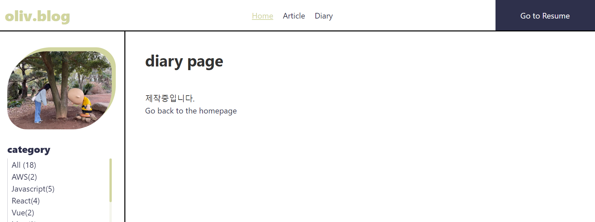
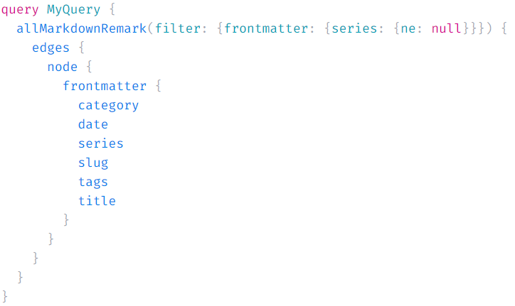
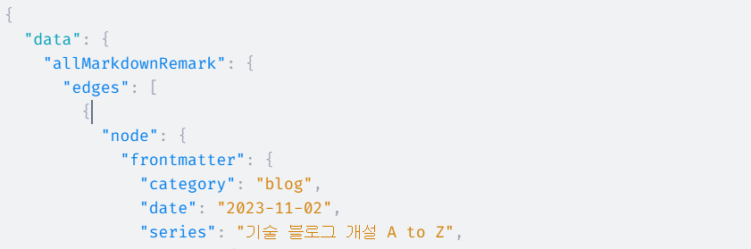

템플릿 없이 하나 하나 원하는 기능 구현중!!  
이번에 구현할 기능은 포스트 시리즈 만들기!!  
앞으로 블로그를 만드는 과정을 시리즈로 소개하거나, 프로젝트의 진행사항을 시리즈로(회고록처럼) 관리하고 싶어서 기능을 구현해보기로 했다.

생각보다 정보가 많이 없지만, 시작해보자!!

### 🛠️ Diary Page

#### Diary Page 만들기

우선 diary.js를 생성해서 diary 페이지를 만들어주었다.

  
  
다음은 graphql에서 데이터를 가져올 수 있도록 'series'를 추가해주었다.
```md
    slug: "/blog-code-prismjs"
    title: "시리즈 포스트 템플릿 만들기"
    date: "2023-11-03"
    series: "기술 블로그 개설 A to Z"
    category: "blog"
    tags: ["blog", "gatsby"]
```

#### graphql로 data 추출

frontmatter를 추가해주었으니, 이제 graphql에서 데이터를 가져오자!
간단하게 graphql GUI를 이용해서 쿼리를 작성하였다.



frontmatter에 series가 있는 md파일만을 원하기에 filter를 이용해서 처리해줬다. filter에 ne는 "not equal"을 의미한다. 따라서 ne: null은 "null이 아닌 것"이라는 의미이다.



원하는 정보를 잘 가져온다. 적용하자!!

#### Data 가공하기

Diary page에 작성하여 Data를 가져왔으니, 가공해야한다.

가져온 데이터를 보면 node와 같이 불필요한 중첩이 있다.

```javascript
    "edges": [
        {
            "node": {
            "frontmatter": {
                "category": "blog",
                "date": "2023-11-02",
                "series": "기술 블로그 개설 A to Z",
                "slug": "/blog-code-prismjs",
                "tags": [
                    "blog",
                    "gatsby",
                    "prismjs"
                ],
                "title": "코드 블럭 하이라이트 추가하기"
            }
            }
        },
    ]
```

불필요한 중첩을 줄이고, seires와 data로 나눈다.

```javascript
let edges = data.allMarkdownRemark.edges
const seriesData = Object.entries(edges).reduce((acc, [_, value]) => {
    const series = value.node.frontmatter.series
    const data = value.node.frontmatter
    return (acc = [
        {
            series: series,
            datas: data,
        },
        ...acc,
    ])
}, [])
```

다음은 같은 series끼리 data 묶기!!

```javascript
const joinObjects = props => {
    const originalArray = props
    const resultObject = {}
    originalArray.forEach(item => {
        const { series, datas } = item
        if (resultObject[series]) {
            resultObject[series].datas.push(datas)
        } else {
            resultObject[series] = {
                series: series,
                datas: [datas],
            }
        }
    })
    const resultArray = Object.values(resultObject)
    return resultArray
}
```

Data가공이 끝났으니, useState와 useEffect를 이용해서  
화면에 뿌려주자!!

```javascript
const [joinSeriesData, setJoinSeriesData] = useState([])
useEffect(() => {
    setJoinSeriesData(joinObjects(seriesData))
}, [])
return (
    <Layout>
        <h1>diary page</h1>
        <p>제작중입니다.</p>
        {joinSeriesData ? (
            <div>
                {joinSeriesData.map(series => {
                    return (
                        <div key={series.series}>
                            {series.series}
                            {series.datas.map(data => {
                                return <div key={data.slug}>{data.title}</div>
                            })}
                        </div>
                    )
                })}
            </div>
        ) : (
            <></>
        )}
        <Link to="/">Go back to the homepage</Link>
    </Layout>
)
```

화면에 잘 나온다!! 오예!!  
블로그로 작성하니 금새 쉽게 한 것 같지만, 은근히 오래 걸렸다;;ㅎㅎ  
공부를 더 열심히 해야겠다...ㅎㅎ  
<br/>
data작업은 완료했으니 다음엔 스타일 작업을 해야겠다. To be continue...💪
