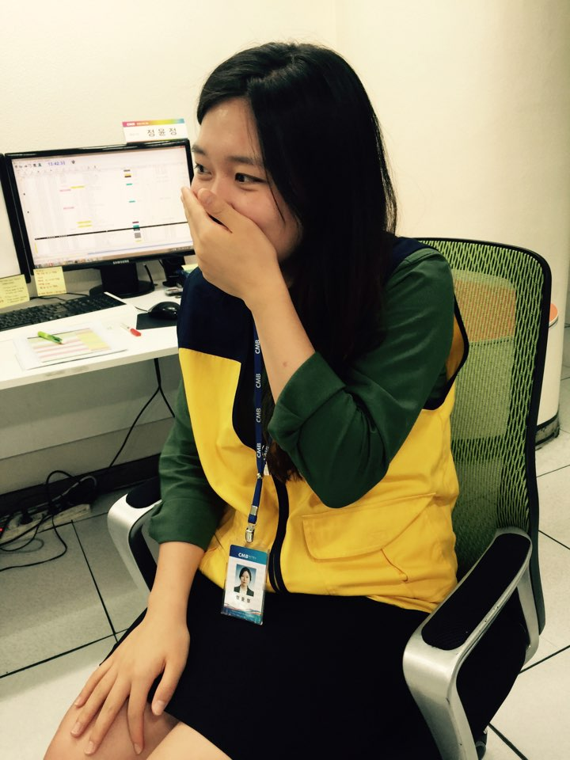
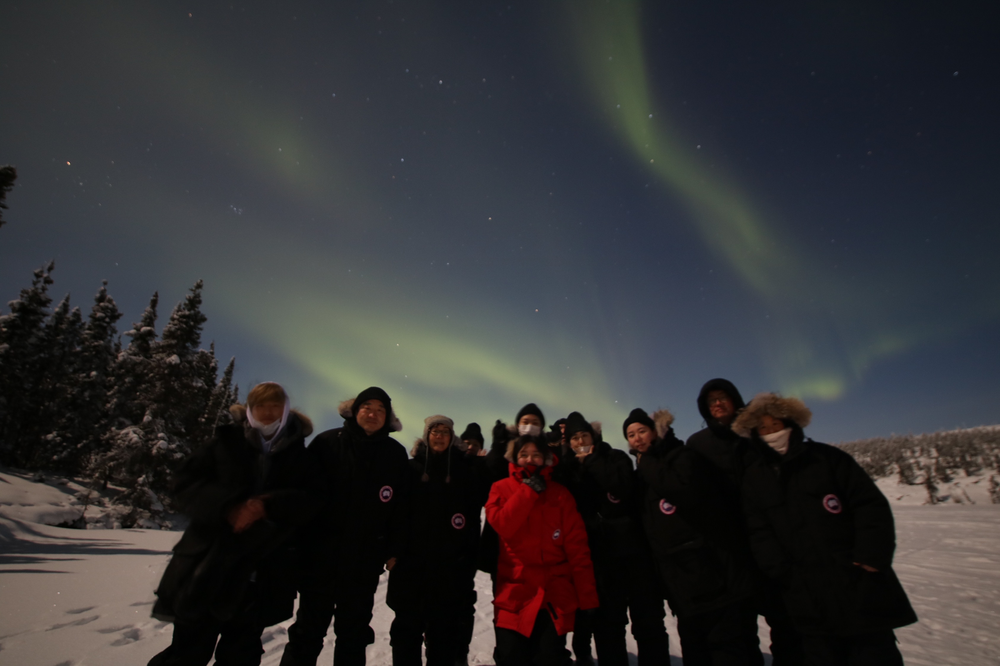
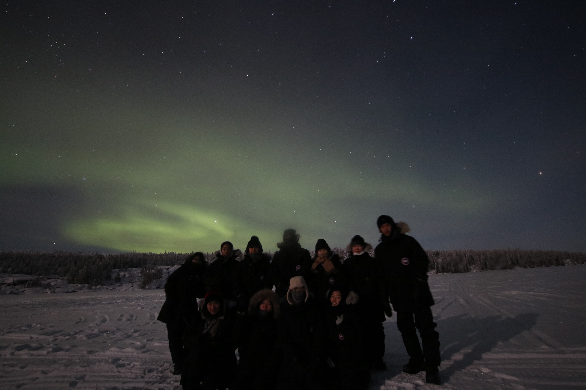
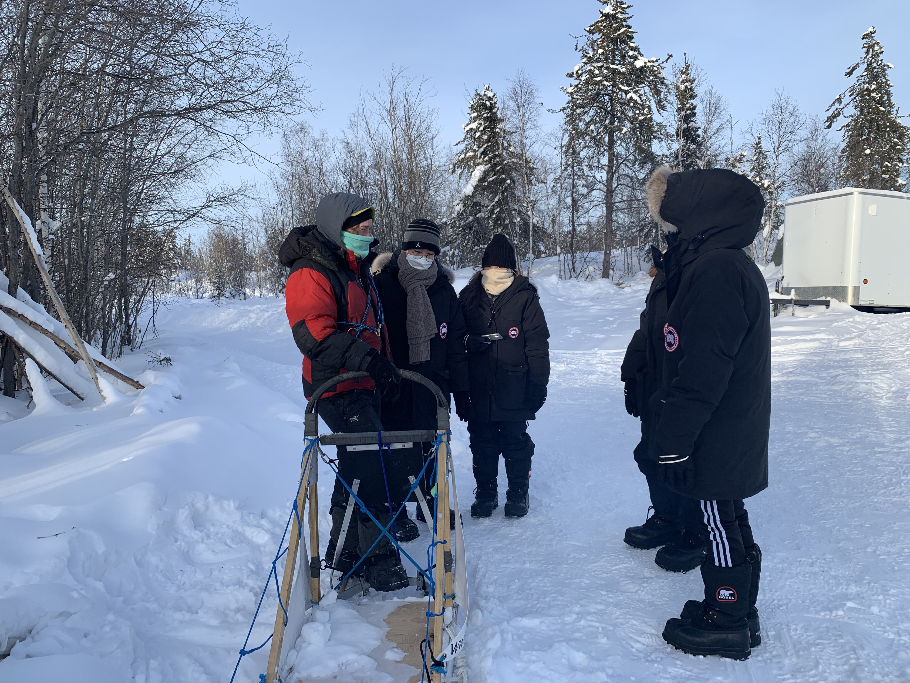
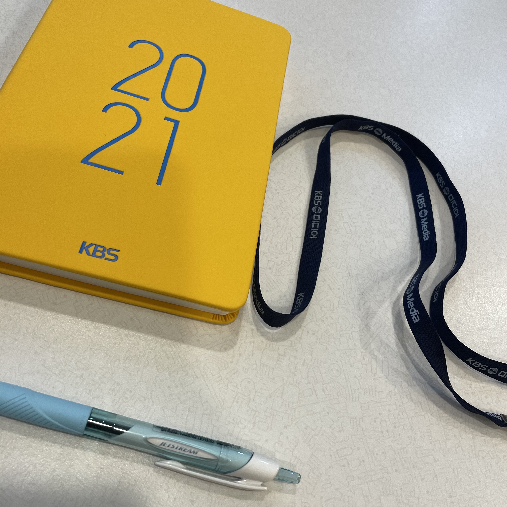

이야기는 고등학교 3학년 여름방학부터 시작하는 것이 좋을 듯 하다.

### 그저 발랄했던 고3 정윤정

고등학교 3학년, 나는 미래를 위한 투자보단 현재의 즐거움에 충실한 학생이었다.
그래서 점심시간, 쉬는 시간마다 그저 친구들과 매점으로 달려가기에 바빴고, 하교 후엔 학생의 신분에 적당히 충실하기 위해 살짝 공부하고 여가 시간엔 TV를 많이 보았다. 부모님께서는 이런 나를 불안해하실 만도 했는데, 자신의 인생은 자신이 만드는 것이라는 태도를 유지하시며 나에게 어떠한 이야기나 강요는 하지 않으셨다.
 
 
그렇게 마냥 발랄한 하루하루를 보내던 중, 고3 여름방학에 나에게 꿈이 생겼다. 매일 보던 “라디오스타”라는 프로그램이 그날은 유독 재밌고 이런 프로그램은 어떻게 만들어지는 것이고, 만든 사람은 누구일까 하는 생각이 들면서 흥미가 생겼고, PD나 작가와 같이 구체적인 직무가 아닌 방송국 직원이 되어서 사람들을 즐겁게 해주는 사람이 되고 싶어졌다. 뒤늦게 꿈이 생긴 내가 할 수 있는 것은 방송, 영상, 미디어 관련 학과 가기를 목표로 노력하는 것이었다. 그렇게 늦게나마 목표를 위해서 조금이라도 더 노력했고, 대전에 위치한 배재대학교 미디어콘텐츠학과에 입학하였다.
 
 
원하던 분야를 배울 수 있어서 학교생활을 정말 재밌게 그리고 열심히 했다. 서울-대전을 통학했던 1학년을 빼면 나머지 학년의 성적은 항상 과 내 상위권에 있었고 과탑을 했던 적도 있을 정도로 전공 공부를 열심히 했고, 영상 제작 동아리 활동도 열심히 했었다. 그때 나라는 사람은 즐겁고 재밌어하면 열심히 하고 잘하는 사람이라는 것을 알게 되었던 거 같다.
 
 
Anyway, 그렇게 4학년이 되고 1학기 끝 무렵 과 선배가 대전지역 채널방송사 채용공고가 올라와서 지원할 거라는 이야기를 들었고, 조금 이르긴 하지만 어쩌면 방송국 직원이 되고 싶은 꿈을 이룰 수 있을지도 모른다는 생각에 지원하게 되었다. 한 번도 써본 적 없는 이력서와 자소서를 최선을 다해서 작성해 지원했다.
 
 
아직 부족한 나를 뽑아줄 리가 없다고 생각했는데 나에게 온 문자 한 통.  
서류 통과!!!!!ㅇㅂㅇ 왁!?!? 저요!? 진짜 저 맞죠!?!? 믿기지 않지만, 기회가 왔다!!!!
정말 정말 귀한 기회를 얻었고, 후회하지 않도록 최선을 다해 준비했고 온 힘을 다해 면접을 봤다. 그렇게 나는 대전지역방송국인 CMB의 직원, 편성PD가 되었다.

### 3년 8개월간 편성PD의 삶!

 
 
지금 생각해 보니 23살에 직장을 다닐 수 있었다니 정말 감사한 거 같다. 사원증을 목에 걸 수 있었던 것도, 노란 조끼도 그저 감사하고 좋았던 거 같다(지금 보니 매우 촌스럽다^^;;). 민원 전화 해결부터 일일, 주간, 월간, 분기, 연간 시청률 보고서를 작성까지 작은 일부터 시작해서 나중엔 채널의 행정을 담당하며 광고, 프로그램 편성 및 운영을 하였다. 그 후엔 조직 개편이 되면서 프로그램 기획, 제작, 편성, 생중계 송출 관리 등을 담당하게 되었다. 다양한 업무를 경험하면서 채널을 이끌어가기 위한 책임감, 방송사고를 예방하기 위한 꼼꼼함, 방송사고 발생 시 해결을 위한 담대함을 배울 수 있었다. 
 
 
일을 열심히 배우다 보니 어느새 3년 차가 되어 있었다. 업무와 야근이 많았지만, 일이 익숙해짐이 느껴졌고, 안일해지고 싶지 않았기에 주말을 이용해 서울로 3D 모션을 배우러 다녔다. 기획과 제작에 즐거운 아이디어를 추가하고 싶은 마음도 있었던 거 같다. 하지만 기대와는 다르게 새로운 기술을 도입하기엔 방송 분야의 시스템 구조 등의 변화는 생각보다 많이 느렸다. 나는 계속 뭔가를 공부하고 습득하고 싶었는데, 그러지 못한 나의 분야가 그때부터 탐탁지 않기 시작했다. 또한 업무의 결과였던 시청률이 생각보다 훨씬 더 외부 영향(날씨 등)을 많이 받는 등 매우 다양한 변수로 인해 스스로 시청률을 컨트롤하지 못한다는 것 때문에 나의 직무에 대해 고민되었고, 때마침 건강 상태도 좋지 않아졌다. 열심히 하는 것만이 미덕이라고 생각했기에 스트레스 관리를 못 했던 탓이 아닐까 싶다. 그렇게 복합적인 이유로 나는 퇴사를 결정하게 되었다.  
 
 

### 오로라 밑에서 나를 다시 생각해 보다.

약 4년간 온 맘을 다해 다녔던 회사를 퇴사한 것도, 대학 시절부터 7년간 살았던 대전에서의 타지 생활을 정리하는 것도 불안하고 무서웠다. 그렇지만 퇴사를 준비하면서 그동안 독립적, 주체적으로 살아왔듯이 다시 한번 가족도 지인도 없는 곳에서 홀로 삶에 대해 고민하고 부딪히며 나를 찾고 싶었다(물론 그 누구의 눈치도 보지 않고 쉬고 싶기도 했다). 그렇게 해외로 가야겠다 결정했고, 캐나다로 떠났다.
 
 
도착해서 지낼 숙소도 알아보지 않고 오른 캐나다 벤쿠버행 비행기. 정말 신기하게 정해진 것 하나 없지만 '얼마나 즐겁게 지낼 수 있을까'라는 흥미로움만 있었다. 그러나 고난은 빠르게 찾아왔다. 비행기에 내려 캐나다에 첫발을 내딛기 무섭게 누군가 나의 캐리어를 가져가 버렸고, 되지도 않는 영어로 겨우 되찾은 캐리어를 끌고 급하게 얻은 숙소에 갔는데 그곳은 음침하고 무서웠다. 숙소를 최대한 빠르게 벗어나기 위해 집을 찾아다녔고, 다행히 안전한 보금자리에 정착할 수 있었다(지금 생각해 보니 정말 대책 없이 갔다). 그렇게 벤쿠버 생활에 금세 적응했지만, 한국인이 많아서 심리적인 안정감이 생겨나는 것이 만족스럽지 못했고, 더욱 외지로 가고 싶어졌다. 한국인이 최대한 없는 곳으로....
 
 
그렇게 옐로우나이프라는 지역으로 가게 되었다. 정말 작은 마을이었고, 오로라를 볼 수 있는 곳으로 한국인은 거의 보지 못했다. 막상 오고 나니 영어도 잘 못하고 걱정이 한가득이긴 했지만, 꾸준히 일자리를 지원하고 공부하며 기회를 기다렸고, 어느 날 공부하고 있던 나에게 여행사 사장이라며 누군가 찾아왔다. 그는 한국인 관광객을 유치하고 싶다며 나에게 함께 일하자고 했고, 나는 영어가 아직 자신 없지만 그것만 괜찮으면 좋다고 대답했다. 그렇게 오로라 투어 가이드가 되었다.
 
 
영하 40도에서 한국, 중국, 일본, 미국 등 다양한 국적의 사람 10~25명을 통솔하며 오로라 투어를 진행해야 한다는 것이 많이 부담되었다. 하지만 시작한 이상 최선을 다하는 나는 문제점과 방법을 정말 많이 고민했다. 영어가 능숙하지 못하다고 생각했기 때문에 소통이 잘되지 않을 수 있다는 문제점은 빠르게 유대관계를 만들 수 있는 고객 몇몇을 찾아 유대관계를 만들고 소그룹장처럼 대신 소통할 수 있도록 했고, 극한의 환경이기에 예민해져서 투어 프로그램에 만족하지 못하는 고객이 생길 수 있는 문제점은 그동안 갈고 닦았던 영상, 사진 촬영 실력으로 인생샷을 남겨주며 좋았던 경험으로 남을 수 있도록 노력했다. 이러한 노력이 확실히 고객들에게 전달이 되었는지 고객들과 빨리 친해지고, 서로 만족스러운 투어를 할 수 있었다. 아직도 SNS를 통해 연락하고 지내는 고객들이 있을 정도니 정말 값진 경험을 했다. 그렇게 수많은 밤을 고객들과 오로라를 보러 다니며 극한의 환경에서도 돌파할 방법과 일에 대한 진심은 고객들에게 통한다는 것, 다양한 돌발상황에 대처하고 보완하는 방법 등을 배웠다. 1년이라는 시간 동안 나라는 사람의 정의를 명확히 내릴 수 있었고, 이 여정은 코로나19로 인해 끝이 나게 되었다.
 
 

### 코드의 매력에 빠지다.

코로나19로 인해 한국으로 돌아오게 되었다. 추억은 추억이고, 한국에 돌아왔으니, 무엇을 하며 살아갈지 고민이 시작되었다. 그동안의 경험을 통해 나에 대해 세워진 정의를 되뇌어봤다.

-   첫번째는 나는 내가 좋아하고 즐기는 일을 할 때 좋은 성과를 거둔다. 이는 나에게 큰 만족감과 행복감을 준다.
-   두번째는 나는 빠르게 변화하는 환경에서도 신속하게 대처하고 적응할 수 있다.
-   세번째는 나는 일을 완료한 후 유의미한 작업물이 남았으면 좋겠고, 나의 기대 혹은 예상과 일치한 결과가 나오는 일을 하고 싶다.

이를 바탕으로 고민하던 중, 퍼블리셔로 근무하고 있는 지인을 만나 이야기를 들었고, 내가 원하던 일과 일치하는 부분이 있다고 생각되었고, 집에 돌아와 바로 관련 코드 작성하는 영상과 자료를 찾아보고 흥미는 확신이 되었다. 확신이 들었으니, 행동으로 옮겼고 그렇게 퍼블리싱 공부를 하게 되었다. 6개월 교육 과정을 들으면서 정말 즐거웠다. 20대 후반에 듣는 교육이라 금전적 여유가 없어 야간 알바를 병행했다. 잠이 부족했음에도 잠을 자는 것보다 코드 한 줄이라도 더 작성하고 싶었고, UI를 하나라도 더 개발하고 싶었고, 해결하지 못한 코드가 있다면 꿈에서라도 고민해서 해결해 냈다(진짜 꿈을 통해 해결한 건 아니지만, 자꾸 작업하는 꿈을 꿨다). 정말 깔끔한 코드를 작성할 줄 아는 사람이 되고 싶어서 노력했고, 그런 시간과 노력을 통해 KBS미디어에 입사하게 되었다.
 
 
  
 
KBS 웹 페이지를 유지보수하고 다양한 특집 사이트를 제작하고, 웹 뷰 작업도 할 수 있었다. 그리고 프로젝트에 투입되며 기획자, 디자이너, 백엔드 개발자와 함께 일하면서 다양한 분야의 사람들과 소통할 수 있었다. 일을 하며 정말 재밌었고, 점차 성장하는 나를 볼 수 있었다. 사수와 주기적으로 코드 리뷰를 하며 안일해질 틈 없이 기초를 다지고, 좀 더 나은 코드와 기술에 대해 고민하고 학습할 수 있었다. 다양한 프로젝트에 투입되면서 React, Vue 등 프레임워크를 다루게 되고, 동적인 데이터를 다루고, 성능 등을 고민하는 좀 더 개발자다운 개발자가 되고 싶어졌다. 근무하면서 계속해서 강의를 듣고, 사이드 프로젝트도 하고, 자격증을 취득하며, 부족한 부분을 채워나갔다. 하지만 좀 더 몰입해서 깊게 프론트엔드 개발에 대해 그리고 웹 전반에 대해 공부하고 싶어졌고, 퇴사를 결정하게 되었다.  
 
 
이렇게 작성하고 보니 정말 다양한 경험을 하며 살아온 거 같다. 이러한 경험들이 나라는 사람을 만들어줬고, 자신을 알게 했고 현재는 개발자로서 더욱 성장하고 더 나은 코드와 기술을 향해 끊임없이 노력하게 했던 것 같다. 늦었나 불안할 수 있을 텐데, 작업을 할 때 그저 즐겁다. 잘 풀리지 않는 작업도 물론 있고, 그럴 때면 머리가 빠질 듯이 고뇌하지만, 이를 해결했을 때의 즐거움과 행복감이 엄청나다. 이런 즐거움, 행복감과 성취감을 원동력으로 지속 가능한 성장을 하는 개발자, UI/UX와 성능, 보안 모두를 해결할 수 있는 개발자로 성장하고 싶고, 성장 중이다.
