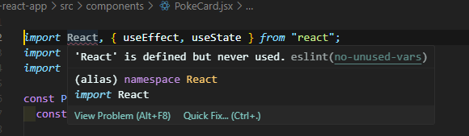

토이 프로젝트를 위해 React 프로젝트를 생성하고,  
eslint, prettier의 몇가지 설정을 한 채로 프로젝트를 진행했다.

### 🚨 에러 발생

그러나, 이 부분에서 자꾸 에러가 났다...  



React라는 변수가 쓰이지 않았다는 오류다;;

개발서버는 에러 없이 잘 돌아가서 문제 없지만,  
VSCode에서 자꾸 빨간 줄과 표시가 생겨서 심기가 불편했다.  
프로젝트가 먼저라고 생각이 들어 계속 무시하다가 결국 해결하기로 마음먹었다... 후

### ❓ 에러 원인

    # eslint 공식 문서
    no-unused-vars
    Disallow unused variables

    Variables that are declared and not used anywhere in the code are most likely an error due to incomplete refactoring. Such variables take up space in the code and can lead to confusion by readers.

선언되었지만 사용되지 않은 변수는 오류일 가능성으로 보고 에러메세지를 준다는 것이다.
React같이 참조적으로 불러오는 경우에도 에러가 발생했던 것이다. 으어..

### 💊 해결 방법

1. eslint 설정 파일에 아래 코드를 추가한다.

```javascript
    "extends": ["eslint:recommended" ,"plugin:react/recommended"]
    // "eslint:recommended" 는 rules page(https://eslint.org/docs/latest/rules/)에 있는 체크표시된 모든 규칙들을 활성화
    // "plugin:react/recommended" 는 eslint-plugin-react의 권장 규칙 세트를 활성화
```

2. 에러나는 부분 옆에 아래의 주석을 단다.

```javascript
// eslint-disable-line no-unused-vars
```

### 마치며🎉

1번 방법으로 바로 해결되어 빨간 에러 표시가 싹 사라졌다.  
나의 코드에 평화가 찾아온듯 기쁘다.  
eslint, prettier 설정을 까먹지 말고 살펴보고 프로젝트를 시작하는 습관을 기르자!

## 출처

-   https://eslint.org/docs/latest/rules/
