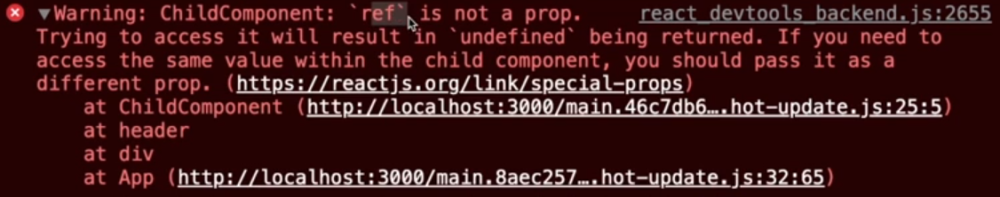

React를 사용하면서 useRef는 많이 사용해봤다!  
프로젝트에서 가끔씩 DOM을 직접 선택해야하는 상황이 발생할 때 ref라는 것을 사용한다.  
ref는 익숙한데, forwardRef는 익숙하지 않다!!  
이번 기회에 익숙해져보자!!

<br/>
ref를 이용하면, DOM element에 손쉽게 접근할 수 있다.

```javascript
const inputRef = useRef();
const handleClick = () => {
    inputRef.current.focus()
}

return (
    <input ref={inputRef}/>
    <button onClick={handleClick}>클릭</button>
)

```

클릭버튼을 눌렀을 때, ref를 이용해 input DOM 요소에 접근하여 focus 한다.  
아주 간단하게 구현할 수 있다.  
<br/>

### 그런데 부모 컴포넌트에서 자식 컴포넌트 안의 DOM element에 접근하고 싶다면?

```javascript
    // ParantComponent.js
    const inputRef = useRef();
    const handleClick = () => {
        inputRef.current.focus()
    }

    return (
        <ChildComponent ref={inputRef}/>
        <button onClick={handleClick}>클릭</button>
    )

    // ChildComponent.js
    const ChildComponent = ({ ref }) => {
        return (
            <input ref={ref}/>
        )
    }
    export defalt ChildComponent
```

함수, 상태 등을 props로 넘겨서 사용하면 되니까, ref도 될거라고 생각했지만,  
🚨에러가 발생한다!! (ref라는 이름을 사용해 넘겼을때!!!) 🚨



ref는 예약어이기때문에 prop으로 사용할 수 없다!!  
이를 해결하기위한 것이 forwardRef 이다!!  
<br/>

### forwardRef 사용법

사용법은 매우 간단하다.

자녀 컴포넌트를 export 할 때, forwardRef로 감싸주고, props와 ref 두 개의 파라미터를 받는다.

```javascript
    // ChildComponent.js
    const ChildComponent = (props, ref) => {
        return (
            <input ref={ref}/>
        )
    }
    export defalt forwardRef(ChildComponent)
```

다양한 사용법이 있지만, 이 정도만 알아두어도 충분할 듯 하다.  
<br/>

### 마치며🎉

사실 forwardRef는 ref를 prop로 넘길 때 필히 ref라는 예약어로 넘겨야 할 때에 유용할 듯 하다!  
그래도 알아두면 언젠간... 쓸 수도 있지 않을까!? 💪
