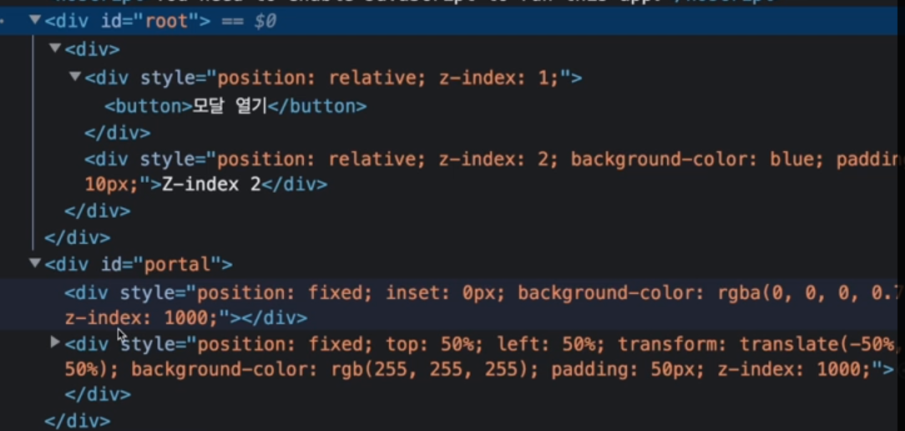

React portal에 대해서 자세히 알아보고,  
가장 유용하게 쓰이는 예시인 modal을 구현해보자!📒
<br/>

### React Portal이란?

React 공식문서에서 Portal을 사용하여 일부 하위 요소를 DOM의 다른 부분으로 렌더링 할 수 있다고 설명한다.  
React Portal은 React 라이브러리에서 제공하는 기능 중 하나로, React 컴포넌트에서 DOM 트리 상에서의 위치를 변경할 수 있도록 해준다.

#### 사용법

import 방법에 따라서 작성하는 법이 약간 다르다.  
Default Import와 Named Import 차이이지만, 가끔 사소한 실수로 작동이 안될 수 있으니 기억해둬야겠다.

```javascript
import ReactDom from "react-dom"
ReactDom.createPortal(children, domNode)
```

```javascript
import { createPortal } from "react-dom"
createPortal(children, domNode)
```

첫 번째 인자(children)은 엘리먼트, 문자열, fragment 등 어떤 종류이든 React로 렌더링할 수 있는 모든 것이고,  
두 번째 인자(domNode)는 DOM 엘리먼트 = document.getElementById() 이다.

#### 사용이유(장점)

❓왜 사용하는 걸까?

1. DOM 구조 관리의 유연성  
   createPortal을 사용하면 React 컴포넌트를 다른 DOM 요소로 이동시킬 수 있다. 이를 통해 DOM 구조를 더욱 유연하게 관리할 수 있게 됨으로서 스타일링 및 레이아웃를 더욱 자유롭게 제어할 수 있다.
2. 범위 제한  
   포탈을 사용하면 특정한 DOM 요소 내에서만 렌더링되도록 제한할 수 있다. 이를 통해 애플리케이션의 일부분에만 영향을 주도록 할 수 있다.

따라서 화면 최상단에 위치해야하는 modal과 같은 UI구현시 유용하게 사용된다.

### Portal로 Modal 구현하기

🛠️ portal 개념을 알았으니 사용해보자!

1. index.html에 modal이 렌더링 될 위치 만들어주자!

    ```html
    <body>
        <div id="root"></div>
        <div id="portal"></div>
    </body>
    ```

2. modal 컴포넌트 생성

    Modal을 위한 컴포넌트를 만들자.

    ```javascript
    import React from "react"
    import { createPortal } from "react-dom"

    const Modal = ({ children }) => {
        const modalRoot = document.getElementById("portal")

        if (!modalRoot) return null
        return createPortal(
            <div className="modal">
                <div className="modal-content">{children}</div>
            </div>,
            modalRoot
        )
    }

    export default Modal
    ```

3. App 컴포넌트에서 Modal 사용하기

    이제 만든 App.js에서 Modal 컴포넌트를 사용해보자

    ```javascript
    import React, { useState } from "react"
    import Modal from "./Modal"
    import "./App.css"

    const App = () => {
        const [showModal, setShowModal] = useState(false)

        const toggleModal = () => {
            setShowModal(!showModal)
        }

        return (
            <div className="App">
                <h1>React Portal Modal 예제</h1>
                <button onClick={toggleModal}>모달 열기</button>
                {showModal && (
                    <Modal>
                        <h2>모달 제목</h2>
                        <p>모달 내용입니다.</p>
                        <button onClick={toggleModal}>닫기</button>
                    </Modal>
                )}
            </div>
        )
    }

    export default App
    ```

구현 완료!!😊😊  
  
portal 요소 안에 modal이 잘 렌더링 된다!!ㅎㅎ

### 마치며🎉

앞으로 유용하게 사용해야겠다. 뜬금없긴 하지만, React portal 이름 참 잘 지은 것 같다 ㅎㅎㅎㅎ
