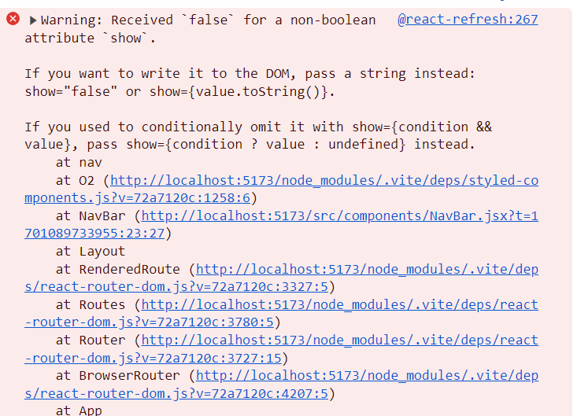
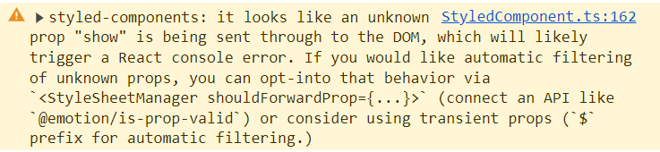

styled-component을 사용했고, css에 prop을 사용했다.  
에러가 난다... 어디보자...

### 🚨 에러 발생

```javascript
const [show, setShow] = useState(false)

return (
    <NavWrapper show={show}>
        <Logo>
            <Image
                alt="poke logo"
                src="https://raw.githubusercontent.com/PokeAPI/sprites/master/sprites/pokemon/other/official-artwork/25.png"
            />
        </Logo>
    </NavWrapper>
)

const NavWrapper = styled.nav`
    position: fixed;
    top: 0;
    left: 0;
    right: 0;
    height: 70px;
    backdrop-filter: ${props => props.show && "blur(10px)"};
    align-items: center;
    padding: 0 36px;
    letter-spacing: 16px;
    z-index: 100;
`
```

scroll 위치에 따라서 show 상태값을 변경하고, 조건부 스타일링을 위해 show를 props으로 전달하여 위와 같이 작성하였다.  
그런데 에러가 발생했다.

#### 🥲문제 1



#### 🥲문제 2



css가 잘 적용되긴 하지만, 빨간 에러...노란 경고... 참을 수 없다... 고쳐보자!!ㅎㅎ

### ❓ 에러 원인

1. HTML은 표준 속성을 가지고 있다. 예를 들면 src, alt 등 다양한 태그는 각각의 표준속성을 지닌다.  
   표준 속성에 반대되는 것은 비표준 속성이라고 한다.  
   -> 따라서 속성은 string 타입으로 전달되어야 하는데, 내가 작성한 코드는 boolean속성이기에 에러가 떴다.

2. string 타입으로 전달하더라도 show라는 표준 속성이 존재하지 않기 때문에 혼란의 여지가 있나보다. 표준 속성이 아닌 prop인 show가 DOM을 통해서 전송되고, 이로 인해 console 오류가 발생할 가능성이 높다는 경고이다.
   -> 이러한 오류를 위해 최근 5.1 버전에서는 새로운 기능이 추가되었다고 한다.

### 💊 해결 방법

1. 속성을 boolean이 아닌 string 타입으로 전달하자.

```javascript
return (
    // show를 string으로 수정
    <NavWrapper show={"show"}>
        <Logo>
            <Image
                alt="poke logo"
                src="https://raw.githubusercontent.com/PokeAPI/sprites/master/sprites/pokemon/other/official-artwork/25.png"
            />
        </Logo>
    </NavWrapper>
)
```

이렇게 수정하면 빨간 에러는 해결되지만, 노란 경고는 해결되지 않는다. 더욱 정확한 해결이 필요하다!

2. prefix 로 "$" 를 사용하여, props 가 실제 DOM 요소에 전달되는 것을 막는다.

```javascript
return (
    // show 앞에 $ 추가하고, boolean 타입으로 사용하기
    <NavWrapper $show={show}>
        <Logo>
            <Image
                alt="poke logo"
                src="https://raw.githubusercontent.com/PokeAPI/sprites/master/sprites/pokemon/other/official-artwork/25.png"
            />
        </Logo>
    </NavWrapper>
)
```

에러와 경고 모두 해결완료!!  
임시방편이 아닌 정확한 방법으로 해결한듯 하다😊

### 마치며🎉

임시방편이 아닌 정확한 해결방법을 알게 되어 정말 다행이다!  
확실히 경고든 에러든 영어라고 읽지 않고 넘어가지 말고, 꼼꼼히 읽어보면 그 안에 답이 들어있는 듯하다.  
오늘도 에러로부터 해방 성공!!💪

### 출처

-   https://mygumi.tistory.com/382
-   https://styled-components.com/docs/basics#passed-props
-   https://dev.to/sarahscode/props-are-not-forever-preventing-props-from-being-passed-to-the-dom-with-styled-components-v5-1-l47
