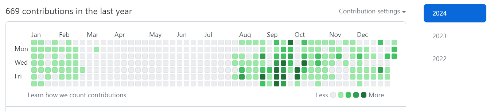
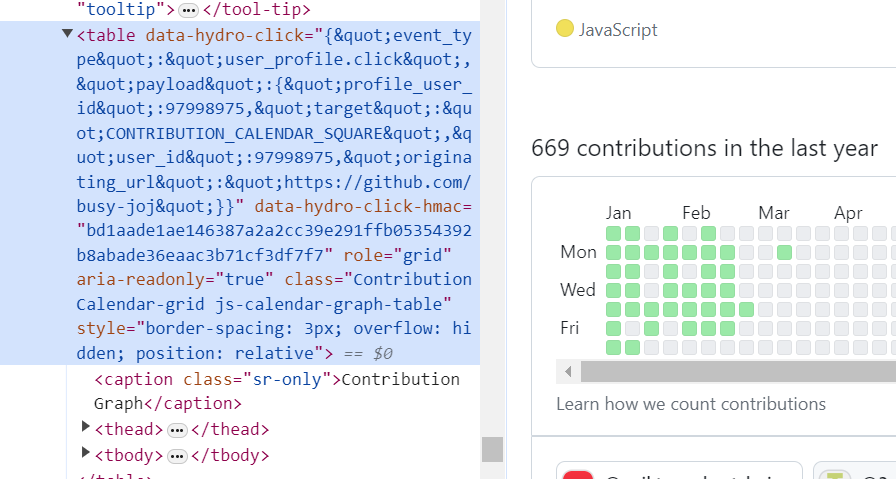
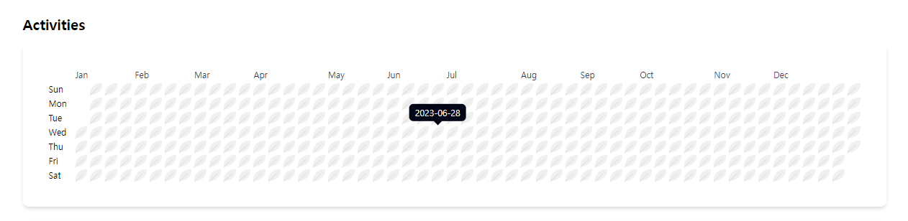

**Project. 코테PT**의 핵심은 git 잔디UI 구현이다!

잔디UI라고 부르는게 맞는지 모르겠지만, 이렇게 칭하도록 하겠다!!

### 👀 잔디UI 분석

1.  **git 잔디**

    개발자도구를 이용해 git 잔디의 HTML구조와 스타일을 분석해보았다.

    

    -   HTML구조는 table 태그로 되어있다. 월은 thead - th태그로, 요일은 tbody - th태그로 날짜는 tbody - td태그로 설계 되어 있었다. 전형적인 캘린더 구조인듯 하다.

2.  **react-activity-calendar**  
    좀 더 찾아보니 react-activity-calendar라는 라이브러리가 있었다. 이를 사용하면 정말 간단하게 구현할 수 있는듯 했다. 그러나 구현만이 목적이 아니고, 학습도 목적이기에 라이브러리를 사용하지 않고, 코드를 참고하여 구현해야겠다고 생각했다.
    -   svg와 rect, g로 구현되어 있다.

조금은 구현이 막막했는데, 분석을 하고 나니 구현방법이 눈에 그려지는 듯하다.  
그리고 두 방법을 비교했을 때 <span class="point">접근성을 고려한 git 잔디의 구조로 작업하는 게 나을 듯하여, git 잔디의 HTML 구조를 참고하되, 라이브러리 로직을 참고하여 작업하기로 결정!!!</span>

### 🛠️ 잔디UI 구현

new Date()의 사용이 참 까다롭고 번거롭다고 생각이 들어서 겁을 먹고 있었는데, 라이브러리를 뜯어보니 date-fns를 사용하고 있었다. 날짜와 시간 계산이 아주 간단해서 유용하게 사용하였다.
<br><br>

1. **지난 365일 날짜 구하기**  
   date-fns의 eachDayOfInterval을 이용하여 시작 날짜와 끝 날짜를 지정하면 간격 내의 날짜 배열을 반환한다. 오늘로부터 지난 365일이 필요했기에 end에 오늘 날짜, start에는 오늘 날짜에서 365일뺀 날로 지정한다.

```javascript
export const generateDate = () => {
    const today = new Date()
    const days = eachDayOfInterval({
        start: subDays(today, 365),
        end: today,
    })

    return days.map(day => formatISO(day, { representation: "date" }))
}
```

2. **365일 배열의 시작날 요일 확인 후 배열 만들기**  
   365일의 날짜 배열을 가지고 잔디UI를 만들 때, 배열의 첫 날짜가 요일의 시작인 일요일이 아니라면 undefined를 담도록 한다.

```javascript
export const getAllActivities = () => {
    const weekStart = 0 // 시작은 sunday
    const normalizedActivities = generateDate()
    const firstDay = parseISO(normalizedActivities[0])
    const firstCalendarDate =
        getDay(firstDay) === weekStart
            ? firstDay
            : subWeeks(nextDay(firstDay, weekStart), 1)
    const allActivities = [
        ...Array(differenceInCalendarDays(firstDay, firstCalendarDate)).fill(
            undefined
        ),
        ...normalizedActivities,
    ]
    return allActivities
}
```

3. **지난 365일을 주차별 구분**  
   365일의 배열을 주차별로 구분하였다.

```javascript
export const getAllActivities = () => {
    const weekStart = 0 // 시작은 sunday
    const normalizedActivities = generateDate()
    const firstDay = parseISO(normalizedActivities[0])
    const firstCalendarDate =
        getDay(firstDay) === weekStart
            ? firstDay
            : subWeeks(nextDay(firstDay, weekStart), 1)
    const allActivities = [
        ...Array(differenceInCalendarDays(firstDay, firstCalendarDate)).fill(
            undefined
        ),
        ...normalizedActivities,
    ]
    return allActivities
}
```

주차별로 가공한 배열을 가지고 thead - th에 월별 위치를 파악하는 함수이다. 월별로 4주 혹은 5주로 다르기 때문에 정확한 th의 위치를 파악해야한다고 생각했다.

```javascript
export const getMonthLabels = (weeks, monthNames) => {
    const monthLabels = weeks
        .reduce((labels, week, weekIndex) => {
            const firstActivity = week.find(activity => activity !== undefined)
            const month = monthNames[getMonth(firstActivity)]
            const prevLabel = labels[labels.length - 1]
            if (weekIndex === 0 || prevLabel.label !== month) {
                return [...labels, { weekIndex, label: month }]
            }
            return labels
        }, [])
        .filter(({ weekIndex }, index, labels) => {
            const minWeeks = 3
            if (index === 0) {
                return labels[1] && labels[1].weekIndex - weekIndex >= minWeeks
            }
            if (index === labels.length - 1) {
                return weeks.slice(weekIndex).length >= minWeeks
            }
            return true
        })
    monthLabels.forEach((_, index) => {
        if (index > 0) {
            monthLabels[index - 1].weekIndex =
                monthLabels[index].weekIndex - monthLabels[index - 1].weekIndex
        }
        if (index === monthLabels.length - 1) {
            monthLabels[index].weekIndex = 52 - monthLabels[index].weekIndex
        }
    })
    return monthLabels
}
```

4. 잔디 UI

```javascript
import { useEffect, useState } from "react"
import { DEFAULT_MONTH_LABELS } from "@/assets/constants"
import {
    getAllActivities,
    getMonthLabels,
    groupByDays,
    groupDatesByWeeks,
} from "@/utils/contribution"

const Contribution = () => {
    const [datesByWeeks, setDatesByWeeks] = useState([])

    const daysOfWeek = ["Sun", "Mon", "Tue", "Wed", "Thu", "Fri", "Sat"]
    const allActivities = getAllActivities()
    const dayActivity = groupByDays(allActivities)
    const monthLabel = getMonthLabels(datesByWeeks, DEFAULT_MONTH_LABELS)

    useEffect(() => {
        const weeks = groupDatesByWeeks(allActivities)
        setDatesByWeeks(weeks)
    }, [])

    return (
        <div className="relative py-5">
            <h2 className="font-bold mb-3 text-xl">Activities</h2>
            <table className="w-full p-8 border-spacing-1 border-separate shadow-md sm:rounded-lg">
                <thead className="text-xs text-gray-700">
                    <tr>
                        <th className="text-transparent text-left opacity-0">
                            요일
                        </th>
                        {monthLabel.map(({ weekIndex, label }) => {
                            return (
                                <th
                                    scope="col"
                                    colSpan={weekIndex}
                                    key={label}
                                    className="text-left">
                                    {label}
                                </th>
                            )
                        })}
                    </tr>
                </thead>
                <tbody>
                    {dayActivity.map((activities, index) => (
                        <tr key={index}>
                            <th className="text-xs w-8 text-left">
                                {daysOfWeek[index]}
                            </th>
                            {activities.map((activity, index) => (
                                <td
                                    key={index}
                                    data-date={activity}
                                    className={`w-4 h-4 ${
                                        activity == undefined
                                            ? "opacity-0"
                                            : "bg-[#F0F0EF]"
                                    } justify-self-center rounded-tl-full rounded-br-full relative after:content-['|'] after:absolute after:left-[30%] after:rotate-[45deg] after:top-[10%] after:text-[#e3e4e2] after:font-thin  group`}>
                                    <span className="hidden rounded-md group-hover:inline-block absolute text-xs z-10 w-max px-2 py-1 origin-center translate-x-[-50%] translate-y-[-130%] ml-2 bg-slate-950 text-white cursor-default before:content-[''] before:w-2 before:h-2 before:bg-slate-950 before:inline-block before:absolute before:top-[100%] before:left-[50%] before:rotate-45 before:origin-center before:translate-x-[-50%] before:translate-y-[-50%]">
                                        {activity}
                                    </span>
                                </td>
                            ))}
                        </tr>
                    ))}
                </tbody>
            </table>
        </div>
    )
}

export default Contribution
```

잔디 UI는 완성!! 이제 기능 작업해야겠다. 잔디가 뿅뿅 잘 심어질 수 있도록!! 가즈아!!


### 마치며🎉

날짜 계산하는 로직을 구현해할 때가 정말 많은데, date-fns를 이용해서 깔끔하고 쉽게 구현할 수 있었다. 잘 기억해두었다가 유용하게 사용해야겠다. 기능 구현한 후에 함수를 리팩토링 해야 할 듯 하다...
